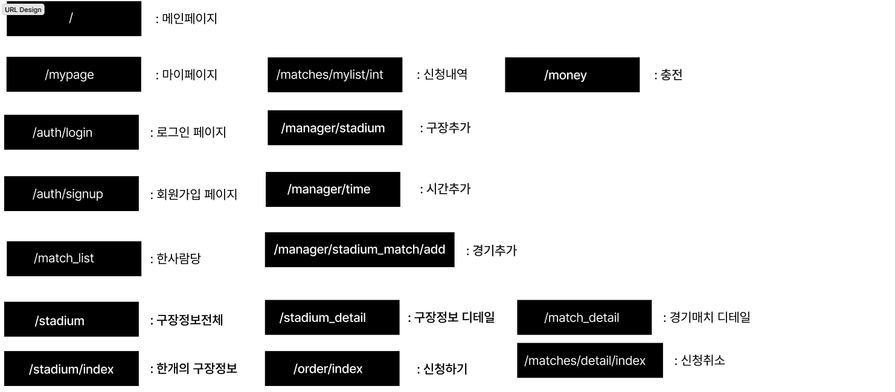
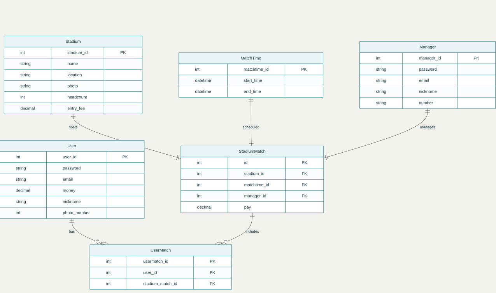

<h1 align="center">⚽ 풋살경기 예약 플랫폼 - FLAB</h1>

## 📑 목차
- [👶 개요](#-개요)
- [❤️ 팀원 소개](#-팀원-소개)
- [⚙️ 기술 스택 및 도구](#-기술-스택-및-도구)
- [⚙️ 핵심 기능](#-핵심-기능)
- [🧱 프로젝트 설계, 구현](#-프로젝트-설계-구현)
- [📸 주요기능 실행 화면](#-주요기능-실행-화면)
- [📝 소감문](#-소감문)

---

## 👶 개요
- 프로젝트 목표 : 플라스크 파이썬 기반 다양한 API를 이용한 축구 구장 예약 중계 웹사이트 개발 프로젝트  
- 개발 기간 : 25/9/23 ~ 25/10/12  

---

## ❤️ 팀원 소개

<table>
  <tr>
    <!-- spring -->
    <td align="center" width="230" style="vertical-align: top;">
        
      <b>박혜영 (spring)</b>
      

      <b>Frontend / Backend</b> 
      마이페이지 구현 머니페이지 구현  
      
    </td>
    <td align="center" width="230" style="vertical-align: top;">
        
      <b>백기림 (summer)</b>
      

      <b>Frontend / Backend</b> 
      DB구현 총괄  
      
    </td>
    <td align="center" width="230" style="vertical-align: top;">
        
      <b>이윤서 (autumn)</b>
      

      <b>Frontend / Backend</b> 
      hreder/footer등 base.html구현 매니저 페이지 구현현  
      
    </td>
    <td align="center" width="230" style="vertical-align: top;">
        
      <b>박종훈 (winter)</b>
      

      <b>Frontend / Backend</b> 
      Matches페이지 구현<>Flatpickr 달력 기반 경기 조회 stadium 페이지 구현br  
      
    </td>
  </tr>
</table>

---

## ⚙️ 기술 스택 및 도구

| 영역 | 기술 스택 |
| --- | --- |
| Front-end |      |
| Back-end |   |
| Database |  |
| Cloud |   |
| Others |    |

---

## ⚙️ 다이어그램

<b>Class Diagram</b>

Entity Realationship Diagram

---

## ⚙️ 핵심 기능

### 👤 일반 회원
- **로그인 / 회원가입** — 계정을 생성하고 개인화된 서비스를 이용  
- **구장 정보 조회** — 등록된 풋살장 정보 및 예약 가능 일정 확인  
- **구장 예약 / 취소** — 원하는 날짜와 시간대에 풋살장 예약 및 취소  
- **이용비 충전/환불** — 원하는 금액을 충전하거나 환불 가능  
- **마이페이지** — 나의 예약 내역, 충전하기, 회원 정보 관리  

### 🛠️ 관리자
- **풋살장 등록 / 수정 / 삭제** — 관리자 권한으로 구장 정보 관리  
- **예약 관리** — 회원들의 예약 현황 확인 및 직접 예약 가능  
- **경기 일정 추가** — 풋살 경기 스케줄 생성 및 관리  

---

## 🧱 프로젝트 설계, 구현

PPT

  

---

## 📸 주요기능 실행 화면

### 회원가입/로그인

  
나의 정보를 입력하여 회원가입을 하거나 로그인 할 수 있습니다

   
  <video controls width="720">
  <source src="readme_img/attachment.mp4" type="video/mp4">
  
  
### [Code](#)

### 경기신청하기

  
만들어 있는 경기를 신청할 수 있습니다.

   
  

### 내 경기 내역  

  
예약 페이지에서는 나의 예약 정보를 ‘신청한 경기’와 ‘끝난 경기’로 구분하여 확인할 수 있습니다.  
‘예약한 경기’는 결제 취소 버튼을 통해 예약을 취소할 수 있고, ‘끝난 경기’는 자동으로 삭제됩니다.  

### 금액 충전/환불

마이페이지에서 충전하기를 누르면 금액을 충전하거나 환불할 수 있습니다

---

## 📝 소감문

